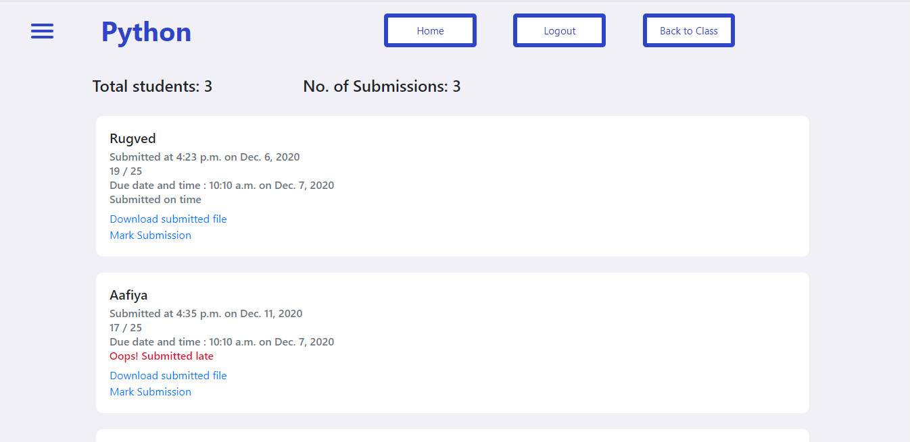
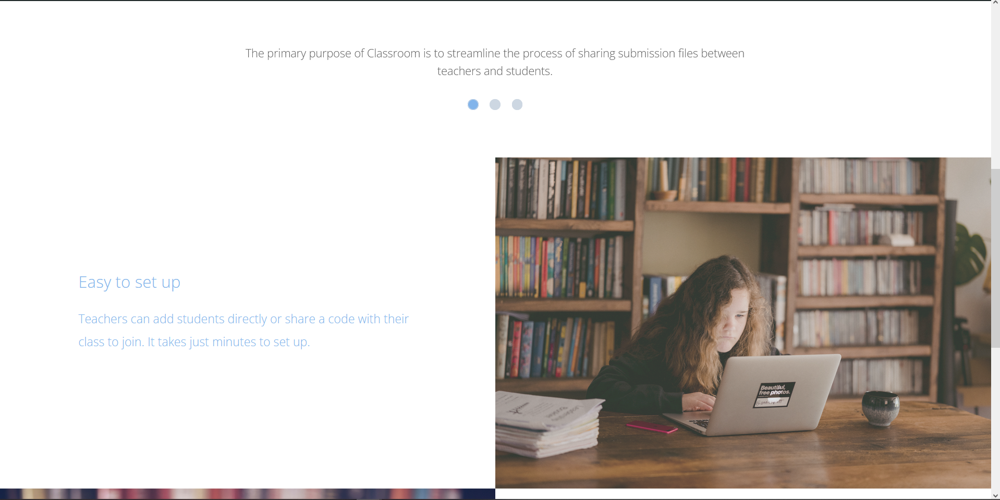
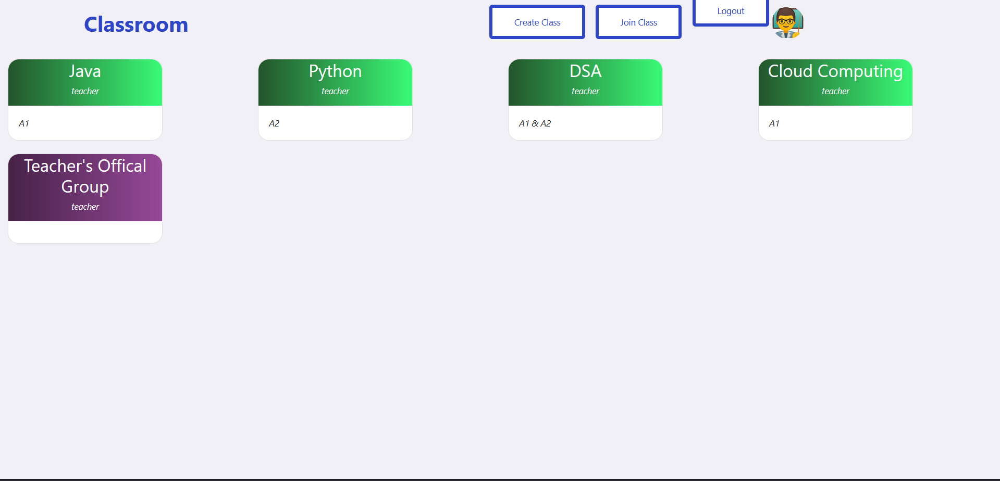

<p align="center"

</p>

<h1 align = 'center'> Classroom
</h1>

<!---
&emsp;&emsp;&emsp;&emsp;&emsp;&emsp;&emsp;&emsp;&emsp;&emsp;&emsp;&emsp;&emsp;&emsp;&emsp;&emsp;&emsp;&emsp;&emsp;&emsp;&emsp; [](https://docs.djangoproject.com/en/3.1/)
--->

<h2 align='center'>
About 
</h2>
<p align='center'>
Online education enables the teacher and the students to set their own learning pace, and there's the 
added flexibility of setting a schedule that fits everyone's agenda. As a result, using an online educational platform allows for a better balance fo work ands studies, so there's no need to give anything up.
</p>

-----------------------------------

<h2 align='center'>
Interface 
</h2>
<p align="center">
  
</p>
<p align="center">
  
</p>
<p align="center">
  
</p>
<p align="center">
  
</p>

-----------------------------------

###             Tech stack
`Backend` : Django <br>
`Database` : SQLite <br>
`Frontend` : CSS, HTML, Bootstrap, jQuery  <br>

-----------------------------------

### Installation steps

A step by step series of examples that tell you how to get a development env running

In your cmd:

```

```

Then,

```
cd Classroom
pip install -r requirements.txt
python manage.py makemigrations
python manage.py migrate
```

Next


Create a .env file, enter your credentials for following fields

```
EMAIL_HOST = ENTER YOUR EMAIL HOST
EMAIL_PORT = ENTER YOUR EMAIL PORT
EMAIL_HOST_USER = ENTER YOUR EMAIL ID
EMAIL_HOST_PASSWORD = ENTER YOUR EMAIL PASSWORD
SECRET_KEY = ENTER ANY RANDOM STRING
```
Then

```
python manage.py runserver
```

You are done with the setup now!

-----------------------------------

<h3 align="center"><b>Developed with :heart: by  <a href="https://twitter.com/zutshi_nihar">Nihar Zutshi</a>
